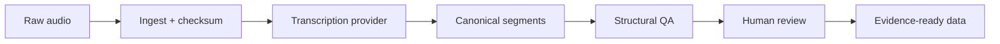

# MEIKA Vox

**Traceable speech-to-data pipelines for qualitative and territorial research.**

MEIKA Vox is an open-source toolkit for turning interviews, workshops and group sessions into structured, auditable qualitative data.

> Audio → transcription → speaker diarization → canonical segments → QA → human review → evidence-ready data

MEIKA Vox is designed as a **data pipeline first**. It does not treat a transcript as a final document and it does not automatically turn speech into findings. Instead, it preserves provenance, timestamps, speaker attribution, processing metadata and review state so downstream analysis can remain auditable.

## Why MEIKA Vox?

Most speech-to-text tools optimize for readable text. Research workflows need more:

- stable identifiers and provenance;
- exact source timestamps;
- speaker diarization;
- reproducible processing runs;
- machine-readable contracts;
- quality checks and human review;
- a clean handoff to qualitative analysis.

## Pipeline



## Data-engineering model

| Zone | Purpose | Mutability |
|---|---|---|
| **Raw** | Original media + source metadata + checksum | Immutable |
| **Canonical** | Provider-independent segments, speakers and timestamps | Versioned |
| **Reviewed** | Human-validated text and speaker labels | Versioned |

A transcript segment is **not** automatically evidence, and evidence is **not** automatically a finding.

## Current status

**Alpha / public R&D.** The initial reference stack is:

- [faster-whisper](https://github.com/SYSTRAN/faster-whisper) — efficient ASR;
- [WhisperX](https://github.com/m-bain/whisperX) — alignment and speaker-aware transcription workflows;
- [pyannote.audio](https://github.com/pyannote/pyannote-audio) — speaker diarization.

## Quick start

```bash
git clone https://github.com/MeikaLab/meika-vox.git
cd meika-vox
python -m venv .venv
pip install -e ".[dev]"
pytest
```

Inspect and fingerprint an audio asset:

```bash
meika-vox ingest path/to/interview.m4a --project-id DEMO
```

## Canonical objects

- `AudioAsset`
- `TranscriptionRun`
- `TranscriptSegment`
- `SourceLocator`

Example:

```json
{
  "segment_id": "SM26-AUD-ABC123-SEG-000041",
  "audio_asset_id": "SM26-AUD-ABC123",
  "segment_index": 41,
  "start_ms": 1101320,
  "end_ms": 1127880,
  "speaker_cluster_id": "SPEAKER_03",
  "text_raw": "El problema acá es que después de las seis no tenemos locomoción.",
  "review_status": "MACHINE_GENERATED"
}
```

## Design references

MEIKA Vox learns from WhisperX, faster-whisper, pyannote.audio, aTrain, noScribe, whisperx-research-transcription and Trail of Bits Scribe while maintaining its own provider-independent contracts and codebase.

## Privacy rule

This public repository must never contain real project audio, productive transcripts, participant identities, consent records, credentials or restricted project data.

See [SECURITY.md](SECURITY.md).

## Roadmap

1. canonical contracts + lineage;
2. local ingestion + checksums;
3. provider interface;
4. WhisperX/pyannote adapter;
5. QA + run manifests;
6. JSONL/Parquet exports;
7. human review interface;
8. Google Drive ingestion;
9. downstream evidence handoff.

See [docs/ROADMAP.md](docs/ROADMAP.md).

## License

Apache License 2.0.

---

**MEIKA LAB** · Open R&D for social, qualitative and territorial intelligence.
